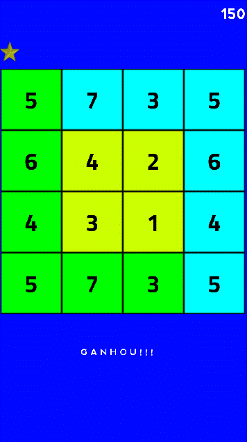
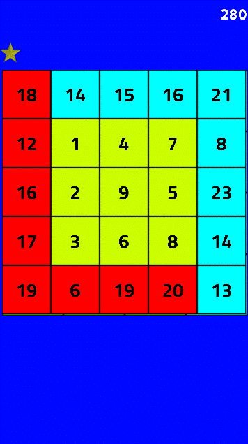
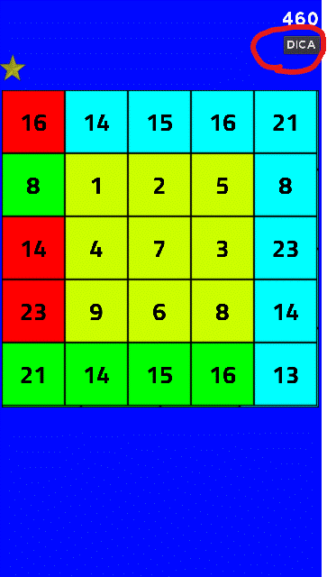
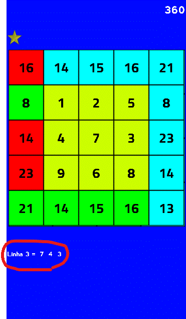
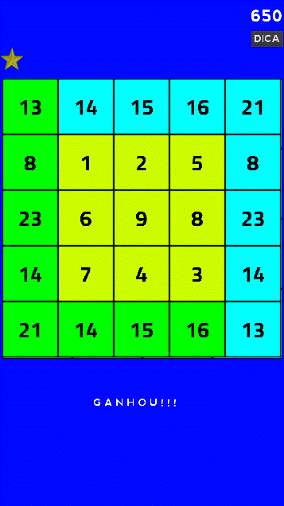
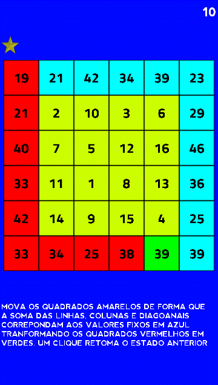
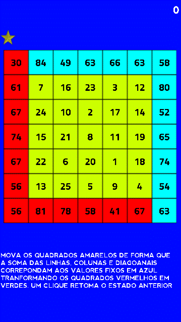

# **Cuadrado Mágico**

# Acerca de
> - Este juego 2D es parte de un conjunto experimental de juegos educativos que se construyó usando el Godot engine y usando el lenguaje GDScript (similar a python)  
> Un cuadrado dividido en pequeños cuadrados que contienen cada uno un número, cuyas sumas de filas, columnas y diagonales dan como resultado valores pares o diferentes.  
> Mueve los cuadrados interiores en amarillo para que sus sumas en vertical, horizontal y diagonal den como resultado los valores estampados en los cuadrados azules.  
>
>   

# Aspectos
> - Este juego está en desarrollo.
> - El juego consiste en un cuadrado dividido en pequeños cuadrados, cada uno de los cuales contiene un número.
> - Arrastra los cuadrados amarillos para que la suma de sus valores en horizontal, vertical y diagonal resulte en los valores de los cuadrados en azul.
> - Solo se pueden mover los cuadrados interiores en amarillo.
> - Un toque o un clic vuelve al estado anterior al último movimiento.
> - Los resultados deseados son los que se muestran en los cuadrados azules que se encuentran en la fila superior y la columna de la derecha.
> - Los cuadrados en rojo contienen los resultados incorrectos, los verdes contienen los correctos.
> - El juego comienza con una cuadrícula interna de 2x2 de cuadrados amarillos, la cuadrícula aumenta en tamaño y dificultad hasta llegar a una cuadrícula de 5x5 cuadrados amarillos.
> - Un contador registra los puntos obtenidos. Los puntos varían según el nivel y con los intentos de error y acierto.
> - En los niveles más difíciles, puedes usar pistas.  

# Diseños
> ## Una página de inicio típica con una cuadrícula interna de 2x2.  
> 

> ## Cuando resuelves el desafío anterior.  
> 

> ## Una página de inicio típica con una cuadrícula interna de 3x3.  
> 

> ## Reproduciendo el paso anterior. Tenga en cuenta el botón de pista.  
> 

> ## Después de hacer clic en el botón de sugerencias. Tenga en cuenta la sugerencia debajo de los cuadrados.  
> 

> ## Felicidades, has ganado el desafío anterior.  
> 

> ## Una página de inicio típica y difícil con una cuadrícula interna de 4x4.  
> 

> ## Una página de inicio típica y muy difícil con una cuadrícula interna de 5x5.  
> 

# Modelos
> - Godot adopta en esencia un diseño orientado a objetos con un sistema flexible de escenas y jerarquías de nodos.
> - Árboles de nodos (nodo: el bloque de construcción más pequeño) que los agrupan en escenas.
> - Los nodos se comunican entre sí a través de señales.
> - Un script en el lenguaje GDScript es una clase que extiende (hereda) una clase de nodo o una nueva clase original.

# Tecnologías
> - Godot engine 2.1.4
>     - http://downloads.tuxfamily.org/godotengine/2.1.4/
> - GDScript (parecido com python)

# Ejecutar el juego
> - Descarga Godot y el juego.
> - Inicie godot e importe el archivo engine.cfg en el directorio raíz del juego.
> - Ejecutar en modo desarrollo o compilar (exportar) para android, ios, windows, linux, etc.

# Autor
> Pedro Vitor Abreu
>
> <soft.pva@gmail.com>
>
> <https://github.com/softpva>