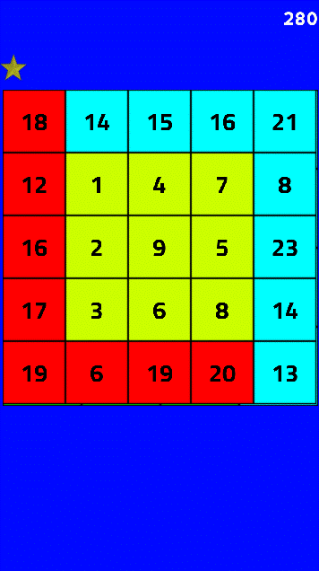
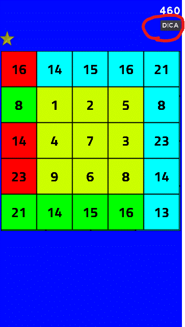
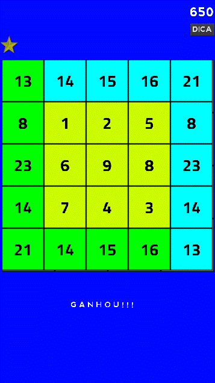

# **Magic Square**

  

# About
> This 2D game is part of a experimental set of educational games built in godot engine using gdscript language. (like python)  
> A square divided into smaller squares each containing a number, such that the figures in each vertical, horizontal, and diagonal row add up to the same or other values.  
> Move the yellow squares so that their sums become equal to the blue squares horizontally, vertically and diagonally.
>
>  

# Features
> - This game is under develpment.
> - The game consists of a square divided into smaller squares each containing a number.
> - Move (drag) the yellow squares so that their sums become equal to the blue squares horizontally, vertically and diagonally.
> - Only the internal yellow squares can be moved.
> - A tap or a click returns to the previous state.
> - The whished result are in the blue squares at the upper row and at the  right column.
> - Red squares contain wrong results, green squares contain correct ones.
> - The game starts with an internal grid of 2x2 yellow squares, the grid increases in size and difficulty until it reaches a grid of 5x5 yellow squares.
> - A counter in the upper right corner records the points earned. Points vary according to level and correct or incorrect attempts.
> - At higher and very difficult levels, you can get up hints.

# Layouts
> ## A typical 2x2 internal grid start page.   
> 

> ## When you beat the first challenge above.    
> 

> ## A typical 3x3 internal grid start page.  
> 

> ## Playing the step above. See hint button.  
> 

> ## After press hint button. See the hint below the squares.   
> 

> ## Congrats, you hit the challenge above.   
> 

> ## A typical dificult 4x4 internal grid start page.  
> 

> ## A typical very dificult 5x5 internal grid start page.  
> 

# Models
> - Godot embraces object-oriented design at its core with its flexible scene system and Node hierarchy.
> - Tree of nodes (node: smallest building blocks) that you group together into scenes. 
> - Nodes communication each other by signals. 
> - A Script in GDScript language is a class that extend (inherit) a node class or you can create a new original one class.

# Tecnologies
> - Godot engine 2.1.4
>     - http://downloads.tuxfamily.org/godotengine/2.1.4/
> - GDScript (like python)

# Kick off
> - Download the engine and the game.
> - Start godot engine and import the engine.cfg in the root directory of the game.
> - Run in dev mode or compile (export) for android, ios, windows, linux, etc.

# Author
> Pedro Vitor Abreu
>
> <soft.pva@gmail.com>
>
> <https://github.com/softpva>
>

