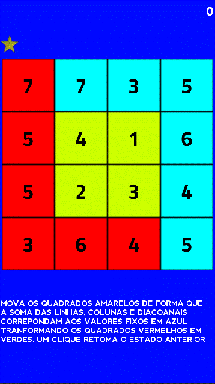
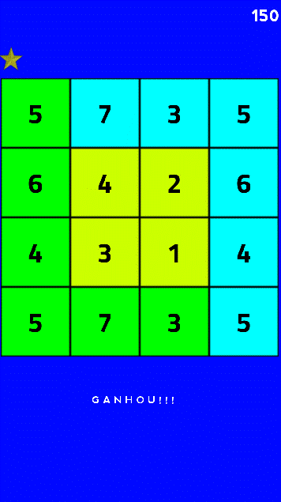
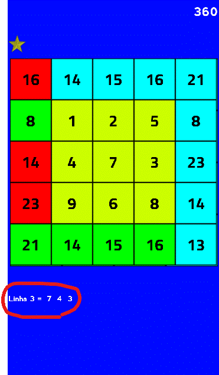
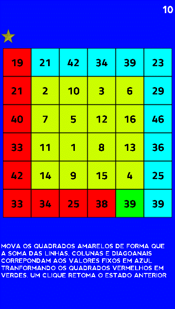

# **Quadrado Mágico**

# Sobre
> - Este jogo 2D é parte de um conjunto experimental de jogos educativos que foi construido utilizando-se a Godot engine e usando a linguagem gdscript (parecida com python)
> Um quadrado dividido em pequenos quadrados cada um contendo um númeor, cujas somas das linhas, colunas e diagonais resultam em esmo ou diferentes valores.  
> Mova os quadrados internos em amarelo de forma que a suas somas na vertical, horizontal e diagonal resultem nos valores estampados nos quadrados azuis.  
>
>   

# Aspectos
> - Este jogo está em desenvolvimento.
> - O jogo consiste em um quadrado dividido em pequenos quadrados cada um contendo um número.
> - Arraste os quadrados amarelos de forma que a soma de seus valores na horizontal, vertical e diagonal resulte nos valores dos quadrados em azul.
> - Apenas os quadrados internos em amarelo podem ser movidos.
> - Um toque ou um click retorna ao estado anterior ao último movimento.
> - Os resultados desejados são os mostrados nos quadrados azuis que estão na linha superior e na coluna à direita.
> - Os quadrados em vermelho contém os resultados incorretos, os verdes contém os corretos.
> - O jogo se inicia com uma malha interna de 2x2 quadrados amarelos, a grade vai aumentando de dimensão e de dificuldade até atingir uma grade de 5x5 quadrados amarelos.
> - Um contador registra os pontos obtidos. Os pontos variam de aordo com o nível e com as tentativas de erro e acerto.
> - Nos níveis mas difíceis, você pode utilizar-se de dicas. 

# Layouts
> ## Uma típica página inicial com grid interno de 2x2.   
> 

> ## Quando você resolve o desafio acima.    
> 

> ## Uma típica página inicial com grid interno de 3x3.  
> 

> ## Jogando a etapa acima. Note o botão de dicas.  
> 

> ## Depois de clicar no botão de dicas. Note a dica abaixo dos quadrados.   
> 

> ## Parabéns, você venceu o desafio acima.   
> 

> ## Uma típica e difícil página inicial com grid interno de 4x4.  
> 

> ## Uma típica e muito difícil página inicial com grid interno de 5x5.  
>   

# Modelos
> - Godot adota em seu núcleo um projeto com orientação a objetos com um sistema flexível de cenas e hierarquias em nós.
> - Árvores de nós (nó: o menor bloco de construção) que agrupa-os em cenas.
> - Nós se comunicam entre si através de sinais. 
> - Um script na linguagem GDScript é uma classe que estende (herda) uma classe nó ou uma nova classe original.

# Tecnologias
> - Godot engine 2.1.4
>     - http://downloads.tuxfamily.org/godotengine/2.1.4/
> - GDScript (parecido com python)

# Rodando o jogo
> - Faça o download do godot e do jogo.
> - Inicie o godot e importe o arquivo engine.cfg no diretório raiz do jogo.
> - Rode em modo de desenvolvimento ou compile (exporte) para android, ios, windows, linux, etc.

# Author
> Pedro Vitor Abreu
>
> <soft.pva@gmail.com>
>
> <https://github.com/softpva>